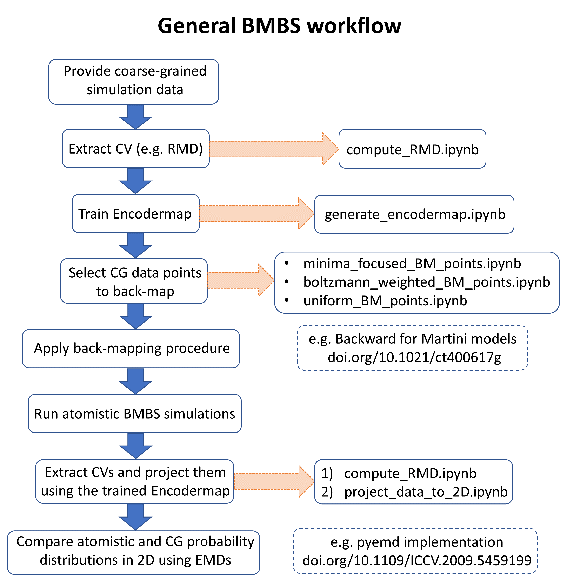

# BMBS of tri-ubiquitin

This repository provides the python notebooks we used to analyse K48-linked tri-ubiquitin data.

## Publication Information:

Titel: "Generating a conformational landscape of ubiquitin chains at atomistic resolution by back-mapping based sampling"

Authors: Simon Hunkler, Oleksandra Kukharenko, Teresa Buhl und Christine Peter

Journal: Frontiers in Chemistry - Theoretical and Computational Chemistry

Research Topic: Recent Advances in Computational Modelling of Biomolecular Complexes

DOI:

## Data Information:

In \notebooks we provide jupyter notebooks containing the code we used to analyse the tri-ubiquitin data shown in the publication.

In \minimal_example we provide a randomly generated subset (28,000 structures) of the original CG data, 
as well as the results of applying the notebooks to this test data.

For the full data set please visit (insert URL/DOI).

## General BMBS Workflow

This workflow visualizes the general data pipeline of the BMBS algorithm.
The blue arrows indicate the workflow, whereas the orange dotted arrows point to the notebooks that can be used in the specific parts of the workflow.
Boxes with dotted borders and without orange arrows connecting them, indicate that we refer to external software that can be used in this part of the workflow.